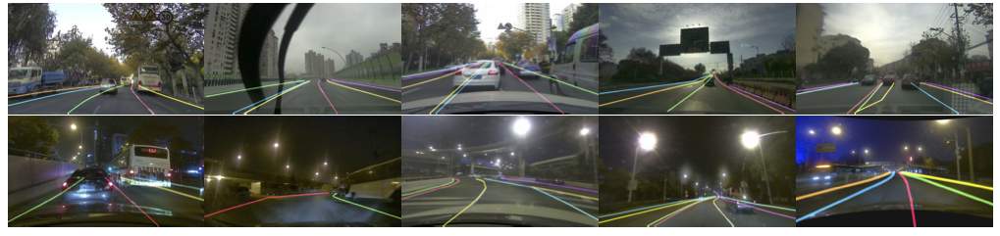

## CurveLanes Dataset


### Introduction

CurveLanes is a new benchmark lane detection dataset with 150K lanes images for difficult scenarios such as curves and multi-lanes in traffic lane detection. It is collected in real urban and highway scenarios in multiple cities in China. We separate the whole dataset 150K into three parts: train:100K, val: 20K and testing: 30K. ~~The original image resolution is 2650×1440.~~

 [>_<]:

<center>    
    <br>    <div style="color:orange; border-bottom: 1px solid #d9d9d9;    display: inline-block;    color: #999;    padding: 2px;">Examples of the CurveLanes. More difficult scenarios such as S-curves, Y-lanes can be found in CurveLanes</div> 
</center>


For each image, we manually annotate all lanes in image with cubic splines. Most of the annotated images in this CurveLanes dataset have more than one curve line with a large curvature. More difficult scenarios such as S-curves, Y-lanes, night and multi-lanes (the number of lane lines is more than 4) can be found in this dataset. 


[>_<]: 

<center>        <br>    <div style="color:orange; border-bottom: 1px solid #d9d9d9;    display: inline-block;    color: #999;    padding: 2px;">Comparison of the distribution of the degree of curvature between common dataset and CurveLanes (left). The proportion of number of lanes in our CurveLanes. Our CurveLanes has more curve lanes comparing to the natural distribution of lanes. CurveLanes also has more lanes than CULane and TuSimple thus more challenging.</div> </center>

More introduction of the dataset can be found in our paper.

### Annotations

The dataset should include three parts: 

1. train: images, labels and train.txt
2. valid: images, labels and valid.txt
3. test:  images and test.txt

For each image, there would be a .lines.json label file, in which each line gives the x, y coordinates for key points of the lane marking.

```python 
{
  "Lines":[
    # A lane marking
    [
      # The x, y coordinates for key points of a lane marking that has at least two key points.
      {
        "y":"1439.0",
        "x":"2079.41"
      },
      {
        "y":"1438.08",
        "x":"2078.19"
      },
      ...
    ]
    ...
  ]
}
```


### Downloads

The Dataset is about 77GB after compression.  We split the whole rar file into 6 parts each has about 13GB. We provide download link from Google Drive and Baidu Pan. 

CurveLanes.part1.rar

https://drive.google.com/open?id=1wqjJolxUeycjsehqD7izqCxJRPb7x-V5

https://pan.baidu.com/s/1KsAkaa01hiGo-qrOxS88-g

CurveLanes.part2.rar

https://drive.google.com/open?id=1hY2Rrffy1mKAWHUSjlTsr5bMil5QwPFx

https://pan.baidu.com/s/1qvIHZlOX7lYYZ9DHRdLRJw

CurveLanes.part3.rar

https://drive.google.com/open?id=1zX_xSRw-l-nYmhlLzK7sin9SuwKv4zxe

https://pan.baidu.com/s/1ZuAH-Tm9qFLVGw6UC1EZvQ

CurveLanes.part4.rar

https://drive.google.com/open?id=1s5puNls7xb9mQEKx8UTfOyd86p2cQUhp

https://pan.baidu.com/s/15_iAiLGhu9RCfksO-pxDuA

CurveLanes.part5.rar

https://drive.google.com/open?id=1mtg2X0cYbv0wSmokbjDHwc7FRdmSBeBA

https://pan.baidu.com/s/1eL83vJ3fCUFCBOKvbFAbPw

CurveLanes.part6.rar

https://drive.google.com/open?id=1zw5a8GXD_pGpAMJDZkLhMObqtO8PqQ8V

https://pan.baidu.com/s/1eEG175SM1v8Ig7H2zhZG_A

### Tools

To be provided.

### License

Any academic and non-academic entities can use this dataset freely for non-commercial purposes such as academic research, teaching, or scientific publications. Permission is granted to use the data given that you agree：

1. That you include a reference to the CurveLanes Dataset in any work you do with the dataset.

2. That you do not distribute this dataset or modified versions. It is permissible to distribute derivative works in as far as they are abstract representations of this dataset (such as models trained on it or additional annotations that do not directly include any of our data).

3. That you may not use the data set or any derivative works for commercial purposes, such as selling data or using it for commercial gain.

4. That the data set is provided "as is". Although we ( Huawei Technologies Co., Ltd. ) have made every effort to ensure accuracy, we cannot accept responsibility for errors or omissions.

5. We ( Huawei Technologies Co., Ltd. )  reserve all rights not expressly granted to you.

   

### Citation

To be provided.

### Acknowledgments

 To be provided.
