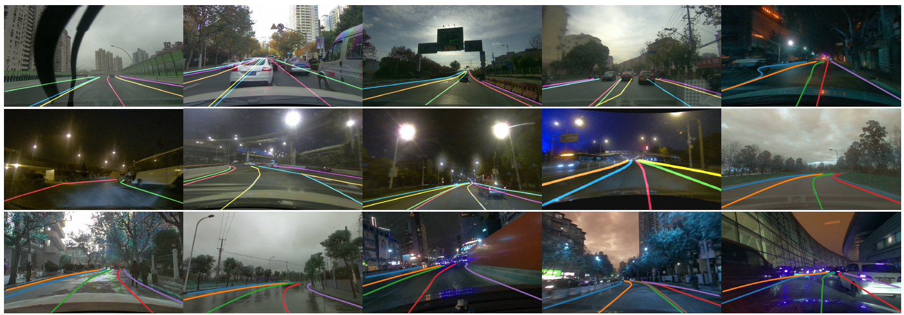
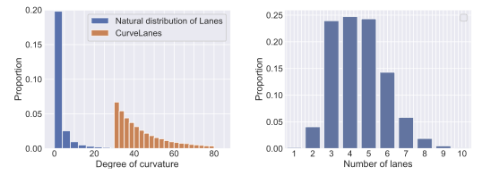

## CurveLanes Dataset


### Introduction

CurveLanes is a new benchmark lane detection dataset with 150K lanes images for difficult scenarios such as curves and multi-lanes in traffic lane detection. It is collected in real urban and highway scenarios in multiple cities in China. It is the largest lane detection dataset so far and establishes a more challenging benchmark for the community.

We separate the whole dataset 150K into three parts: train:100K, val: 20K and testing: 30K. The resolution of most images in this dataset is 2650×1440.


For each image, we manually annotate all lanes in image with natural cubic splines. All images are carefully selected so that most of them image contains at least one curve lane. More difficult scenarios such as S-curves, Y-lanes, night and multi-lanes (the number of lane lines is more than 4) can be found in this dataset, as shown below. 



Comparison of the distribution of the degree of curvature between common dataset and CurveLanes. The proportion of number of lanes in our CurveLanes. Our CurveLanes has more curve lanes comparing to the natural distribution of lanes. CurveLanes also has more lanes than CULane and TuSimple thus more challenging, as shown below. 




More introduction of the dataset can be found in our paper. For all the images, we have used automatic programs to remove faces and 
license plate of cars to keep privacy of all the road users.

### Annotations

The dataset should include three parts: 

1. train: images, labels and train.txt
2. valid: images, labels and valid.txt
3. test:  images and test.txt

For each image, there would be a .lines.json label file, in which each line gives the x, y coordinates for key points of the lane marking.

```python 
{
  "Lines":[
    # A lane marking
    [
      # The x, y coordinates for key points of a lane marking that has at least two key points.
      {
        "y":"1439.0",
        "x":"2079.41"
      },
      {
        "y":"1438.08",
        "x":"2078.19"
      },
      ...
    ]
    ...
  ]
}
```


### Downloads

The Dataset is about 76GB after compression.  We split the whole rar file into 6 parts each has about 13GB. We provide download link from Google Drive and Baidu Pan to facilate users from all over the world. 

CurveLanes.part1.rar

https://drive.google.com/open?id=1nTB2Cdyd0cY3nVB1rZ6Z00YjhKLvzIqr

Link: https://pan.baidu.com/s/1-nmUOCrU0twBZtOe_neuLw Extraction code: m67c

CurveLanes.part2.rar

https://drive.google.com/open?id=1iv-2Z9B6cfncogRhFPHKqNlt-u7hQnZd

Link: https://pan.baidu.com/s/1YrLK9tm7jRpgwaIDOzUplA  Extraction code: 8adg

CurveLanes.part3.rar

https://drive.google.com/open?id=1n2sFDdy2KAaw-7siO7HWuwxUeVb6SXfN

Link: https://pan.baidu.com/s/10UTTRkgk5dDPXJZBQT4jAg Extraction code: ur4e 

CurveLanes.part4.rar

https://drive.google.com/open?id=1xiz2oD4A0rlt3TGFdz5uzU1s-a0SbsX8

Link: https://pan.baidu.com/s/1b-dShapx3Q0SyYqdhzujxQ  Extraction code: ognl

CurveLanes.part5.rar

https://drive.google.com/open?id=1vpFSytqlsJA-rzfuY2lyXmZvEKpaovjX

Link: https://pan.baidu.com/s/18wvCPNaQHiJmQ0YeNJOYsA  Extraction code: i6r8

CurveLanes.part6.rar

https://drive.google.com/open?id=1NZLvaBWj0Mnuo07bxKT7shxqi9upSegJ

Link: https://pan.baidu.com/s/1nqQ-uPnsDzQs3T35yhQqDw  Extraction code: 9q0y

### Evaluation Tools

To be provided.

### License

Any academic and non-academic entities can use this dataset freely for non-commercial purposes such as academic research, teaching, or scientific publications. Permission is granted to use the data given that you agree：

1. That you include a reference to the CurveLanes Dataset in any work you do with the dataset.

2. That you do not distribute this dataset or modified versions. It is permissible to distribute derivative works in as far as they are abstract representations of this dataset (such as models trained on it or additional annotations that do not directly include any of our data).

3. That you may not use the data set or any derivative works for commercial purposes, such as selling data or using it for commercial gain.

4. That the data set is provided "as is". Although we have made every effort to ensure accuracy, we cannot accept responsibility for errors or omissions.

5. We reserve all rights not expressly granted to you.

   

### Citation

To be provided.

